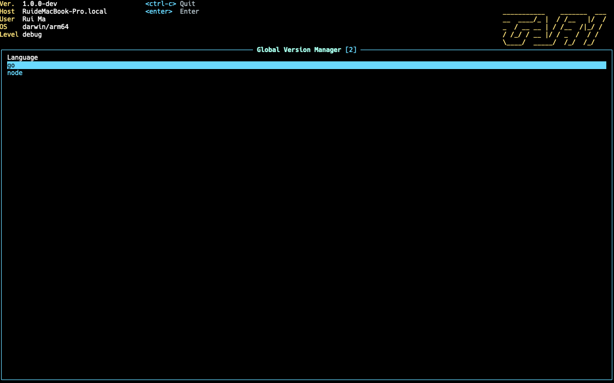
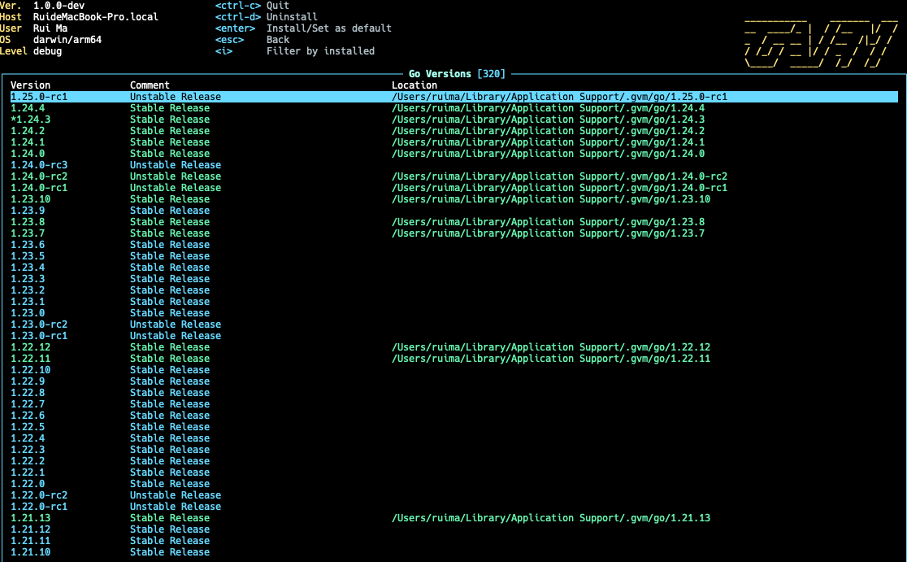

# GVM(Global Version Manager)
编程语言版本管理器，像`nvm`一样，但是支持扩展到所有编程语言


[](https://github.com/toodofun/gvm/blob/master/LICENSE)

[](https://goreportcard.com/report/github.com/toodofun/gvm)
[](https://codecov.io/gh/toodofun/gvm)

* 🚀 支持的交互方式
  * 命令行界面（CLI）
    * `ls-remote <lang>`：列出语言的远程版本
    * `ls <lang>`：列出语言已安装的版本
    * `install <lang> <version>`：安装语言的特定版本
    * `uninstall <lang> <version>`：卸载语言的特定版本
    * `use <lang> <version>`：设置语言的默认版本
    * `current <lang>`：显示语言的当前版本
  * 终端用户界面（TUI）
    * `ui`：在终端页面中运行
* 🚀 支持的编程语言
  * [x] Golang
  * [ ] Node
  * [ ] Java
  * [ ] Python

## 截图
### 语言页面


### 版本管理页面


## 命令行
```shell
MacBook-Pro :: ~ » gvm -h
A tool to manage multiple versions of programming languages.

Usage:
  gvm [command]

Available Commands:
  completion  Generate the autocompletion script for the specified shell
  current     Show Current version of a language
  help        Help about any command
  install     Install a specific version of a language
  ls          List installed versions of language
  ls-remote   List remote versions of language
  ui          Run in the terminal UI
  uninstall   Uninstall a specific version of a language
  use         Set default versions of language

Flags:
  -d, --debug   debug mode
  -h, --help    help for gvm

Use "gvm [command] --help" for more information about a command.
```

## 历史 星星

[](https://star-history.com/#toodofun/gvm)

## 致谢
感谢[JetBrains](https://www.jetbrains.com/)通过其开源许可计划支持本项目并提供出色的开发工具。