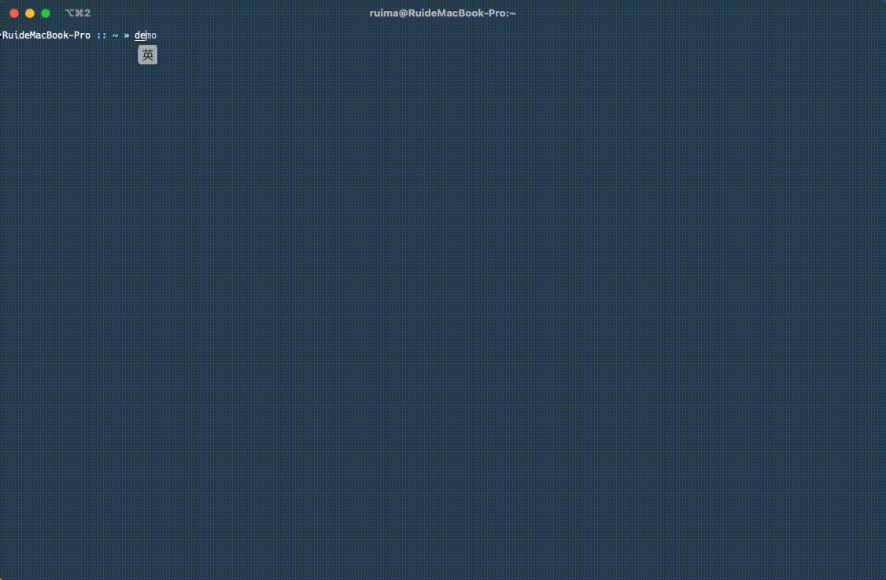

<div align="center">
	<h1>GVM (Global Version Manager)</h1>
	<p>GVM is a programming language version manager, like `nvm`, but extensible to support all programming languages.</p>
</div>


[](https://goreportcard.com/report/github.com/toodofun/gvm)
[](https://github.com/toodofun/gvm/releases)
[](https://hub.docker.com/r/toodo/gvm/)
[](https://github.com/toodofun/gvm)

[](https://github.com/MR5356/toodofun/gvm)
[](https://codecov.io/gh/toodofun/gvm)

<p align="center">
	<a href="#-installation">Installation</a> ❘
	<a href="#-features">Features</a> ❘
	<a href="#-supported-programming-languages">Languages</a> ❘
	<a href="#-quick-start">Quick-Start</a> ❘
	<a href="#-license">License</a>
</p>

> English | [简体中文](README_zh.md)

```shell
A tool to manage multiple versions of programming languages.

Usage:
  gvm [command]

Available Commands:
  completion  Generate the autocompletion script for the specified shell
  current     Show Current version of a language
  help        Help about any command
  install     Install a specific version of a language
  ls          List installed versions of language
  ls-remote   List remote versions of language
  ui          Run in the terminal UI
  uninstall   Uninstall a specific version of a language
  use         Set default versions of language

Flags:
  -d, --debug   debug mode
  -h, --help    help for gvm

Use "gvm [command] --help" for more information about a command.
```

## 🤘&nbsp; Features
- Manage multiple versions of various programming languages (e.g., Go, Node, Java, etc.; more coming soon)
- Easy installation, uninstallation, and switching between language versions
- List both locally installed and remotely available versions for each language
- Operate via both Command Line Interface (CLI) and Terminal User Interface (TUI)
- Set default versions for each language
- Shell autocompletion for faster command input
- Cross-platform support, with Docker images and binary releases
- Extensible architecture—easy to add support for new languages

## 🐍&nbsp; Supported Programming Languages
- [x] Golang
- [x] Node
- [ ] Java
- [ ] Python
- [ ] C#
- [ ] C++/C
- [ ] Ruby
- [ ] Rust

## 🌈&nbsp; Screenshots
### Usage

### Languages Page


### &nbsp; Version Management Page


## 🐳&nbsp; Docker Container
### Release
```
docker pull toodo/gvm
docker run -it -e TERM=xterm toodo/gvm ui
```
🔔 **Note:** The above example runs the `gvm ui` command in an interactive terminal. To run `gvm` against other compatible servers, or to enter the container interactively for debugging or inspection, use:

```
docker run -it --entrypoint=/bin/sh toodo/gvm
```

## 📦&nbsp; Installation

### 📁 From Binary

Download the appropriate version for your platform from the [releases page](https://github.com/toodofun/gvm/releases).

### 🛠️ From Source
- compile glctl and place it in _output/
```bash
git clone https://github.com/toodofun/gvm.git
cd gvm
make build
```

## 🚀&nbsp; Quick Start

### 📄&nbsp;Usage
  ```bash
  gvm <command> [flags]
  ```

- Run terminal UI
```bash
 gvm ui
```

### 🥪 Available Commands
* Command Line Interface (CLI)
- `ls-remote <lang>`: List remote versions of a language
- `ls <lang>`: List installed versions of a language
- `install <lang> <version>`: Install a specific version of a language
- `uninstall <lang> <version>`: Uninstall a specific version of a language
- `use <lang> <version>`: Set the default version of a language
- `current <lang>`: Show the current version of a language

* Terminal User Interface (TUI)
  * `ui`: Run in terminal interface

## 💕&nbsp;Acknowledgements
Grateful acknowledgement to [JetBrains](https://www.jetbrains.com/) for supporting this project through their Open Source License Program and providing exceptional development tools.

## 🧠&nbsp;TODOs
- This cli tool is still in the development stage, and most of the programming languages are not completed. Everyone contribute is very much needed. 🙋‍♂️

## 🤝&nbsp;Issues

If you have an issue: report it on the [issue tracker](https://github.com/toodofun/gvm/issues)

## 🧑‍💻&nbsp;Contributing

Contributions are always welcome. For more information, check out the [contributing guide](CONTRIBUTING.md)

## 💕&nbsp; Star History

[](https://star-history.com/#toodofun/gvm)

## 📘&nbsp; License

Licensed under the Apache License 2.0. See [LICENSE](LICENSE) for details.
