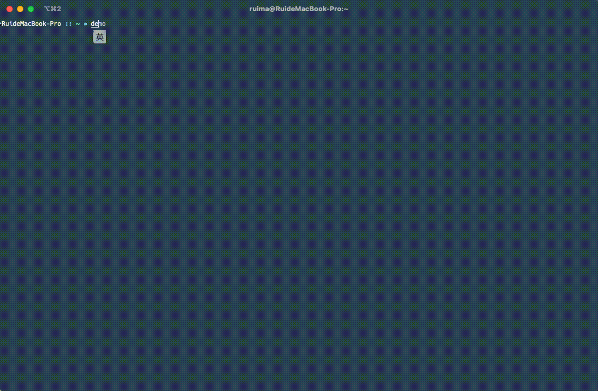

<div align="center">
	<h1>GVM（全局版本管理器）</h1>
	<p>GVM 是一个编程语言版本管理器，类似于 `nvm`，但可扩展以支持所有编程语言。</p>
</div>


[](https://goreportcard.com/report/github.com/toodofun/gvm)
[](https://github.com/toodofun/gvm/releases)
[](https://hub.docker.com/r/toodo/gvm/)
[](https://github.com/toodofun/gvm)

[](https://github.com/MR5356/toodofun/gvm)
[](https://codecov.io/gh/toodofun/gvm)

<p align="center">
	<a href="#-安装">安装</a> ❘
	<a href="#-特性">特性</a> ❘
	<a href="#-支持的编程语言">支持的语言</a> ❘
	<a href="#-快速开始">快速开始</a> ❘
	<a href="#-许可证">许可证</a>
</p>

> [English](README.md) | 简体中文

```shell
A tool to manage multiple versions of programming languages.

Usage:
  gvm [command]

Available Commands:
  completion  Generate the autocompletion script for the specified shell
  current     Show Current version of a language
  help        Help about any command
  install     Install a specific version of a language
  ls          List installed versions of language
  ls-remote   List remote versions of language
  ui          Run in the terminal UI
  uninstall   Uninstall a specific version of a language
  use         Set default versions of language

Flags:
  -d, --debug   debug mode
  -h, --help    help for gvm

Use "gvm [command] --help" for more information about a command.
```

## 🤘&nbsp; 特性
- 管理多种编程语言的多个版本（如 Go、Node、Java 等，更多语言持续添加中）
- 轻松安装、卸载和切换语言版本
- 支持列出本地已安装和远程可用的语言版本
- 支持命令行界面（CLI）和终端用户界面（TUI）
- 可为每种语言设置默认版本
- Shell 自动补全，提升命令输入效率
- 跨平台支持，提供 Docker 镜像和二进制包
- 架构可扩展，便于添加新语言支持

## 🐍&nbsp; 支持的编程语言
- [x] Golang
- [x] Node
- [x] Java (zulu)
- [x] Python
- [ ] C#
- [ ] C++/C
- [x] Ruby
- [x] Rust

## 🌈&nbsp; 截图


## 🐳&nbsp; Docker Container
### Release
```
docker pull toodo/gvm
docker run -it -e TERM=xterm toodo/gvm ui
```
🔔 **Note:** 以上示例在交互式终端中运行 `gvm ui` 命令。
要针对其他兼容服务器运行 `gvm`，或以交互方式进入容器进行调试或检查，请使用:

```
docker run -it --entrypoint=/bin/sh toodo/gvm
```


## 📦&nbsp; 安装

### 📁 二进制安装

从 [releases 页面](https://github.com/toodofun/gvm/releases)下载适合你平台的版本。

### 🛠️ 源码安装
- 编译 glctl 并放置到 _output/
```bash
git clone https://github.com/toodofun/gvm.git
cd gvm
make release
```

## 🚀&nbsp; 快速开始

### 📄&nbsp;用法
  ```bash
  gvm <命令> [参数]
  ```

- 运行终端界面
```bash
 gvm ui
```

### 🥪 可用命令
* 命令行界面（CLI）
- `ls-remote <lang>`：列出语言的远程版本
- `ls <lang>`：列出已安装的语言版本
- `install <lang> <version>`：安装指定版本
- `uninstall <lang> <version>`：卸载指定版本
- `use <lang> <version>`：设置默认版本
- `current <lang>`：显示当前版本

* 终端用户界面（TUI）
  * `ui`：运行终端界面

## 💕&nbsp;致谢
感谢 [JetBrains](https://www.jetbrains.com/) 通过其开源许可计划支持本项目并提供出色的开发工具。

## 🧠&nbsp;TODO
- 本 CLI 工具仍处于开发阶段，大部分编程语言支持尚未完成，非常欢迎大家贡献代码 🙋‍♂️

## 🤝&nbsp;问题反馈

如有问题，请在 [issue tracker](https://github.com/toodofun/gvm/issues) 提交。

## 🧑‍💻&nbsp;贡献

欢迎任何形式的贡献。更多信息请查阅 [贡献指南](CONTRIBUTING.md)

## 💕&nbsp; Star 历史

[](https://star-history.com/#toodofun/gvm)

## 📘&nbsp; 许可证

本项目基于 Apache License 2.0 许可。详见 [LICENSE](LICENSE)。 
